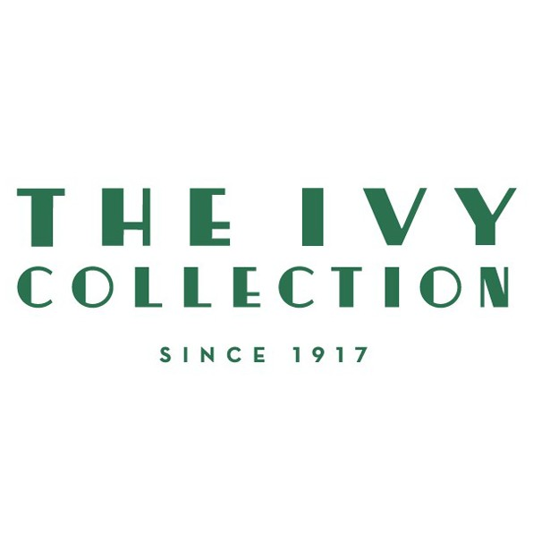

The Ivy. You may have heard this before. The restaurant that every celebrity dines at. The restaurant for the blossoming of every romance. The restaurant that stands admired simply for its name.

But how did it get to be like this? Well, for me and what I am here to observe, it all comes down to its typography and branding. Because at the forefront of it all, this is what people see before anything else.

The Ivy Oxford Brasserie is what I will focus on for this article, however.

Here we can see that the brassiere uses a rather old-style serif in all caps with an interestingly high contrast stroke. Although each letter begins quite thick, it thins out towards the end to provide a very elegant and sophisticated feel. As it is quite bold and wide in width, it does not fail to stand out against any sort of background and immediately draws attention.

What is more, I feel that this sort of type appears rather mysterious especially through the dark emerald-like green colours which link back to its symbolism of the ivy. It goes well hand in hand with the fact that the restaurant provides private dining experiences too and that it is not solely a restaurant for romantic dates or family dinners.

The type in the banner of the website’s page although uses a different serif font in that it is not as high contrast as the logo, looks good alongside of it none the less. It proves easy to read and easy to navigate (Which becomes a theme in such restaurants and their branding as you will learn to see in all my upcoming articles, by the way!).

The colour scheme also continues to remain true to its brand, with a blue/green type against the cream ‘parchment paper’, surrounded by a border of beautifully arranged fruit. The menu feels nostalgic, inviting, and easy to read. Discussing the menus to these sorts of restaurants is rather quite exciting and The Ivy does not fail in providing this. With a multiverse of old-style serif type it is obvious that this is the brand that they are going for. Channelling older, more formal types of elegant dining experiences, typical to brasseries.

Who wouldn’t want to dine here over other contenders?