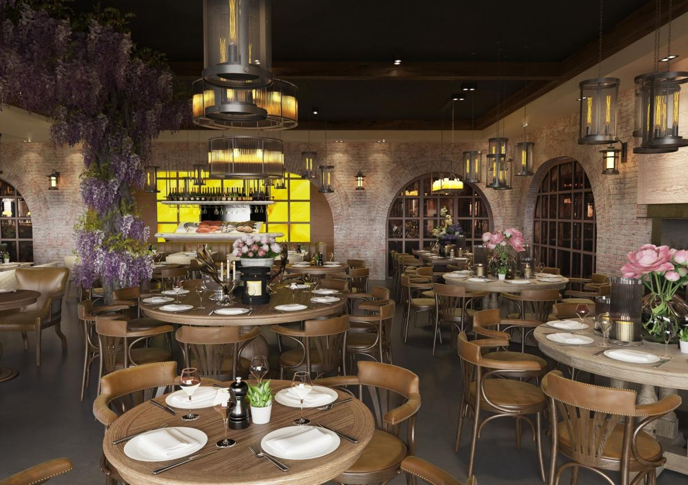

This modern American style restaurant embodies the most upscale, romantic type of dining. With multiple branches across the UK, Victor’s is distinguished for its picturesque interior and wide range menu options. 

So, it comes as no surprise that the brand puts a lot of effort into its creative marketing strategy.

Their logo is very majestic, presenting a large ‘V’ topped with a symbolic crown, surrounded by what appears to be ivy leaves. What is interesting to note however, is the fact that the typeface in contrast, is not as intricate.