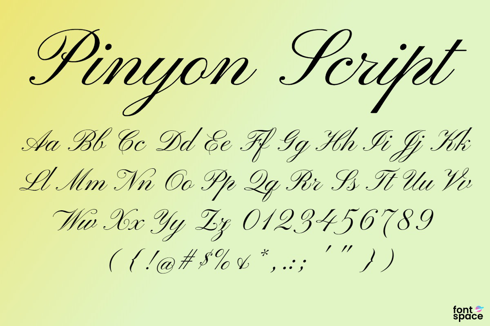

This modern American style restaurant embodies the most upscale, romantic type of dining. With multiple branches across the UK, Victor’s is distinguished for its picturesque interior and wide range menu options. 

So, it comes as no surprise that the brand puts a lot of effort into its creative marketing strategy.

Yum, I mean who wouldn’t want to dine here?

Their logo is very majestic, presenting a large ‘V’ topped with a symbolic crown, surrounded by ivy leaves. What is interesting to note however, is the fact that the typeface in contrast, is not as intricate. With a very plain sans serif lettering and all caps, it is impossible to discuss the choices behind its typographic positioning as they are all level with one another. Even the colour choices remain simple, grey. With no need to up-sell itself. This simple lettering gives way to the actual logo and brand of the company instead, something that presents magnificence. Splendour. Luxury.

If we begin to look at it even closer, it seems the type shows no contrast and is quite regular in both height and weight.

This does well to present modesty in the company’s values; that of good service and upscale dining, whilst remaining friendly with their guests and not too formal. If you were to dine at Victor’s you wouldn’t be showered with robotic waiters, available at your every beckon and call, but instead actual humans with different personalities, channelling this into their enjoyable service.

Now, even though Victor’s may not be a restaurant that takes themselves too seriously (in the best way possible), the company still does a lot to be recognised as an upscale dining sort of restaurant which can be very clearly seen in their menu.

With one look at this menu, it is obvious that what you get will be of the finest quality. Whilst the majority of the writing remains in the same easy-to-read, capitalised sans-serif as the one in the logo, the script type in each subheading of the menu advocates value. The beautiful calligraphy-like writing definitely adds an extra dimension to the whole experience. It forms an idea in the mind of each guest. That this place will not fail to deliver in quality.

The font here used is script, which has been around since the 17/18th century, mimicking the quill writing used back then. It has a rather high contrast stroke, and its slanted demeanour makes it so that it is best read at large. So, the way in which Victor’s have made use of it is actually in the best way possible. Simply for subheadings, hinting at elegance without overpowering the entire menu. It forms a trust with the guest, cursive = friendly. At Victor’s you will be provided with an honourable experience.

Which yes, is most definitely the case. No, you will not order a steak and chips and receive the tiniest slice of meat topped with a chip for décor as you may expect in such similar ‘snobbish’ places. 

At Victor’s your food will be as pleasant as the service.