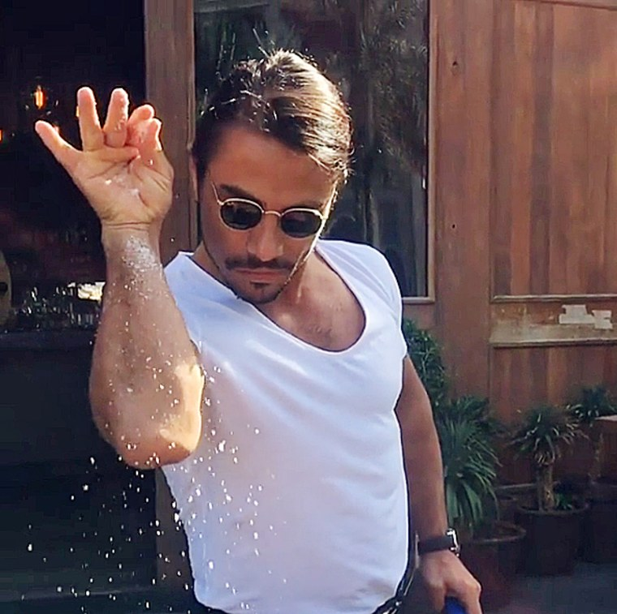
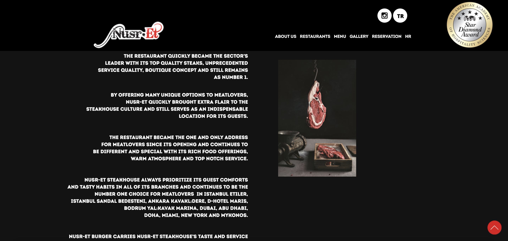
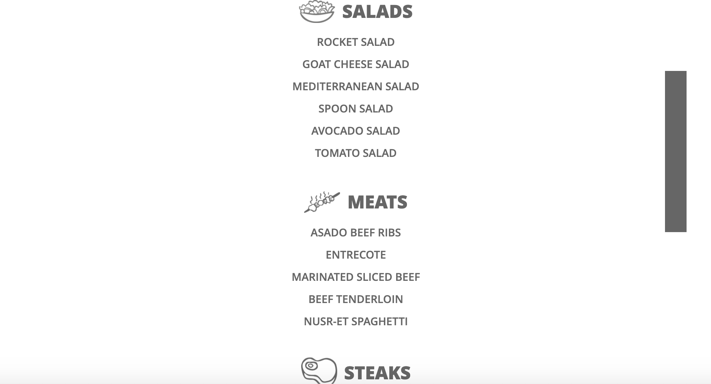

Do you ever see a brand and think: What were they thinking with that? 

Some companies just check all the boxes, and some not so much. With all respects to Salt Bae and his ability to transform a mere internet meme from 2017 to a multi-million-dollar luxury chain of steak houses, perhaps a different typographic approach to his brand could have been of more benefit.

Of course, this is just a subjective judgment but at first glance the website does not convey the grandeur that matches the experience and expenses of Nusr-et.

The introductory text of the restaurant’s web page and all other aspects all display a bold plain white serif against a black background. The text has little to no contrast, a very artless take on publicising. Perhaps a higher contrast stroke could have at least transformed this website into something less tacky and blocky.

 By adding a bit of dimension, similar to the menu font of The Ivy, it could have helped to channel the enigmatic yet classy feel that Nusr-et is undoubtedly trying to achieve.

The menu, however, has not been too intolerably fashioned. After all, it is a steakhouse and not a place for the most glamorous fine dining. With Salt Bae’s key demographic audience being young adults and those who have been following his rise over the years through social media, his marketing strategies have been somewhat decent. The menu’s typography does not appear as blocky and chunky as first seen in the website’s About Us section. It is still low in contrast and all caps but is not completely all bold, making it more readable and less vigorous.

The images beside each subheading, presenting the type of food, helps to give the menu more depth. It looks well-defined and easy to comprehend. Again, much better tailored for the younger generation demographic.

The brand’s logo also demonstrates something that they have done well. Completely separate from the website and its typographic choices, the logo uses a moderately high contrast serif stroke. The swirls around the letters N and T add to the splendour and imagery of the fire and grill. It looks extremely impressive especially with the faded ‘blaze-like’ effect and red/black colour scheme.

So, this poses the question. Who designed this website? And who designed the logo? Because, they channel two completely different pictures and convey two different messages for the upscale type of dining of this steakhouse. Perhaps Nusr-Et should invest some of the finances made from his global chain into funding better typographic marketing for his website…