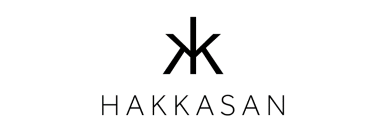
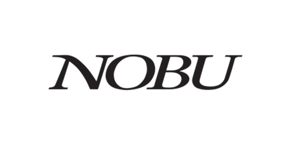
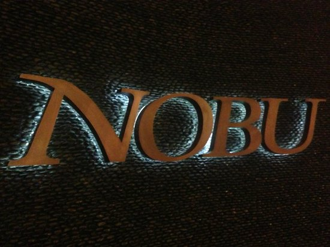
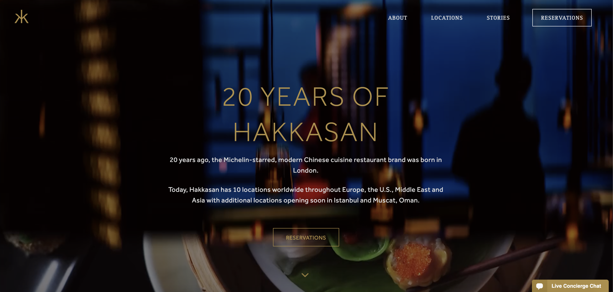
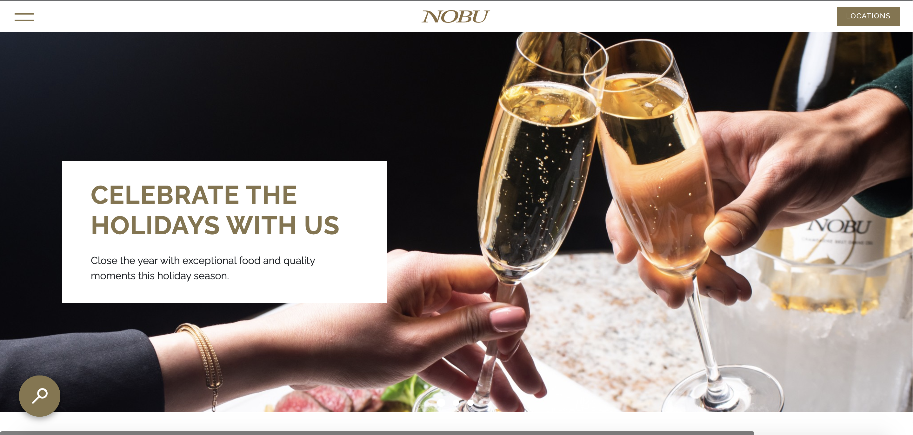
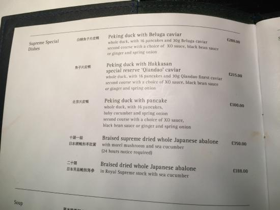
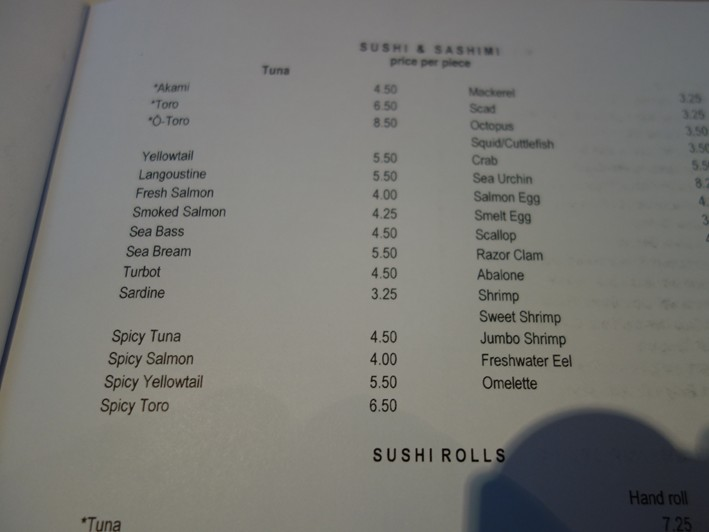

It really is one or the other. Both exceptional, both renowned, and both the most luxurious of restaurants.

Hakkassan is a beautiful modern architecturally designed Chinese restaurant based in the heart of London, they has since expanded globally. Nobu on the other hand, is an American founded restaurant company, famous for their fusion of Japanese recipes using Peruvian ingredients.

For years people have debated the number 1 position, down to their food, drinks, and service. So, who would win at a 1 v 1 in their typographic decisions?

Lets start by analysing the first thing we see when looking at these brands…the logos.

Actually, the two prove to be very similar at first glance. Both use very similar medium contrast strokes in all caps. The lettering for both logos are extremely thin and subtle without doing too much. They serve well in channelling the connotations of their brands; graceful and deluxe.

They both take on very similar colour schemes too. Whilst the logo for Nobu often appears in a simple black/white on websites and online pages, on in person signs it is often a magnificent gold colour. This once more channels the rich implications of the restaurant and serves well to promote the brand’s image.

Now, taking a look at Hakkasan’s website we see immediately the similarities. Hakkasan too adopts the gold/black/white colour scheme. 

The logo in the top left corner of their website also appears to be gold. It is clear that both restaurants utilise the gold colour specifically to match the scale and format of different platforms. Against their dark background website and fast pace moving slideshow of images, a black/white logo will not have been very coherent, however, the rich gold is. It is in this exact way that Nobu goes about their typographic strategy as their website takes on the same approach.

The next thing that must be assessed is most definitely in fact the two menus…and surprise, surprise! The two are not far off from being completely identical(!) – minus the food items obviously. Both menus simply present the available food options against plain white backgrounds.

Hakkasan’s menu uses a very simple serif style typography with the main items in a bolder, slightly larger font. It does not appear tacky or tasteless but rather, allows the brand and company’s glory to speak for itself. Not much is needed as the company’s target demographic are not those who need to find splendour in finer details – instead, they are well accustomed to such experiences and find beauty in simplicity. 

As to keep up with their company’s modern aesthetic, perhaps this is the reason why Nobu’s menu utilises a Sans serif style which we do not often see in upscale places of dining. Normally, such places favour a simple Serif and if not a Script style, however, Nobu takes simplicity to a whole new level. The pages of their menu hold no sort of allure, allowing once more for their brand to speak for itself.

So, the result of the 1v1 although was not able to determine a righteous 'winner', showed that the classier places of upscale dining seem to do less and less in their typographic strategies as they find themselves to be already well renowned. There seems to be no need to play up their glamour as to appease other demographic groups and charm people in. As globally recognised companies, they know what they are doing and seem to be doing well as so.