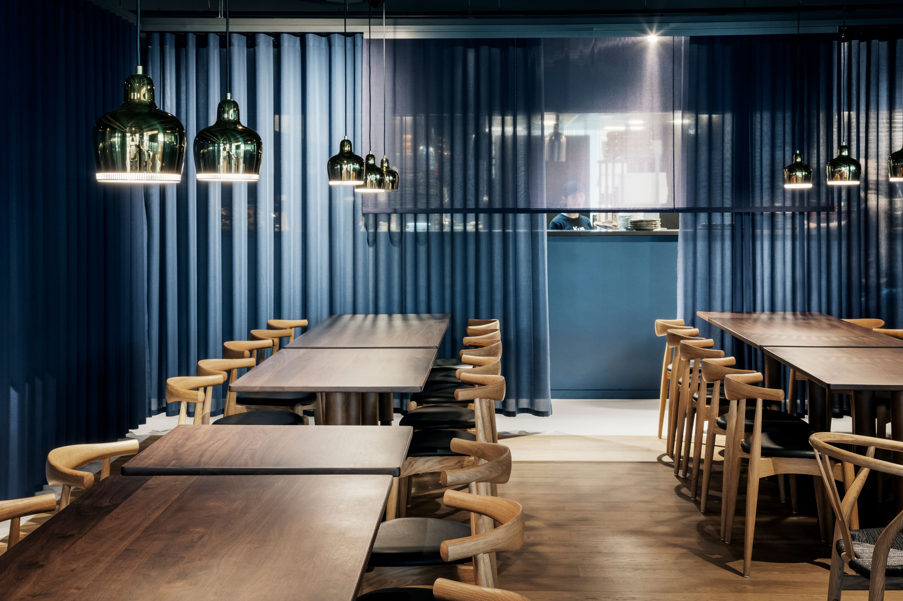
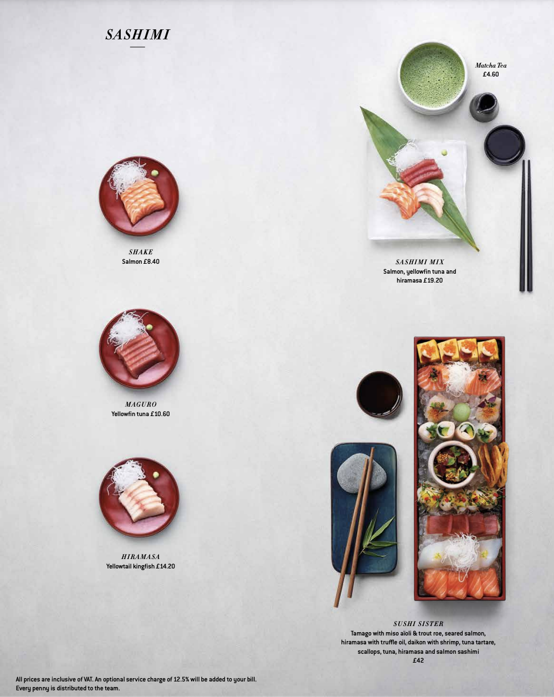

Irrashaimase! If you’ve ever so much as step foot in sticks n sushi you are familiar with this greeting which means ‘welcome to the restaurant!’.

Sticks n sushi stands as one of the most inviting and hospitable places to dine. A restaurant that takes pride in being a place where they ‘serve not just the great food experience – but the full experience’.

A lot of this comes down to their global marketing strategy which remains similar across most of its branches. And, just as I am here to observe…their typographic choices.

The sans serif style in all caps once again proves to be typical to upscale dining, presenting guests with a very basic but effective design. The capital letters are all level with one another and there does not appear to be any contrast in stroke. As a globally acknowledged brand, there is no need for over-the-top designs, so the company have chosen the best possible typography that is visible at all sizes and in all formats. It utilises a very representative colour scheme associated to Japanese cuisine that also works well with its Danish ties – red, white (and black).

As a company, Sticks n Sushi are able to channel their concepts into their typography in a very well-formed and sophisticated manner. The menu is one of the most well-crafted aspects of this, using a blend of different styles, fonts, and type characteristics.

Each subheading describing the category of food is in italic capitals, making it very easy to differentiate. A common theme of the menu becomes the simplicity in it as each dish is presented visibly for the guests to see. Everything is extremely straightforward with a plain greyish/white background, almost like a table presenting the array of food. The components of these dishes are then listed underneath in a small bold, sans font in a low contrast stroke style.

These aspects make it especially inviting and do well for the brand’s intentions. As a ‘different’ restaurant fusing Japanese and Danish cuisine, it is important that guests are aware of what they are signing up for and the minimalism of such typography in a menu allows for this. Everything is presented simply to them on a plate, just like their food will be.