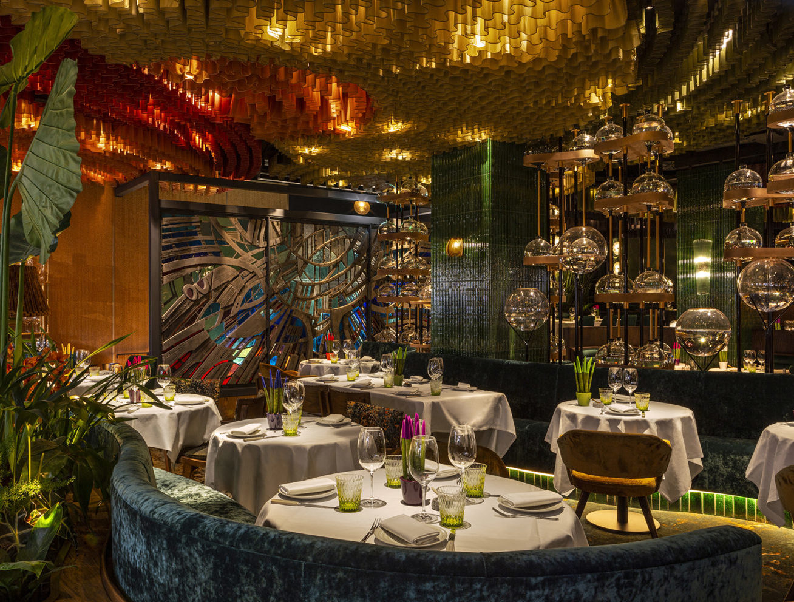
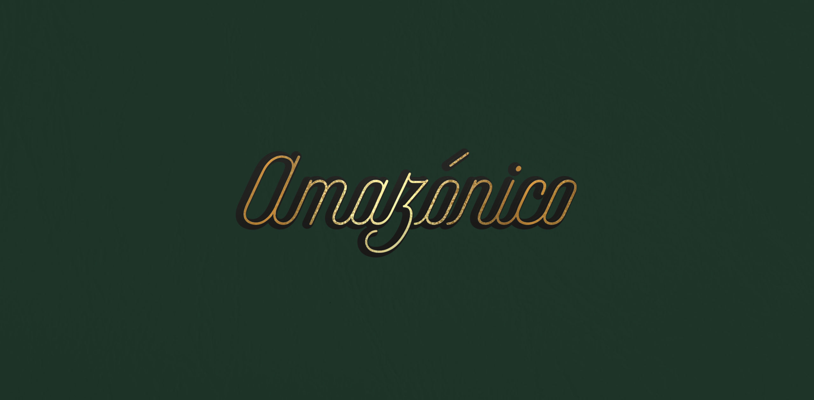
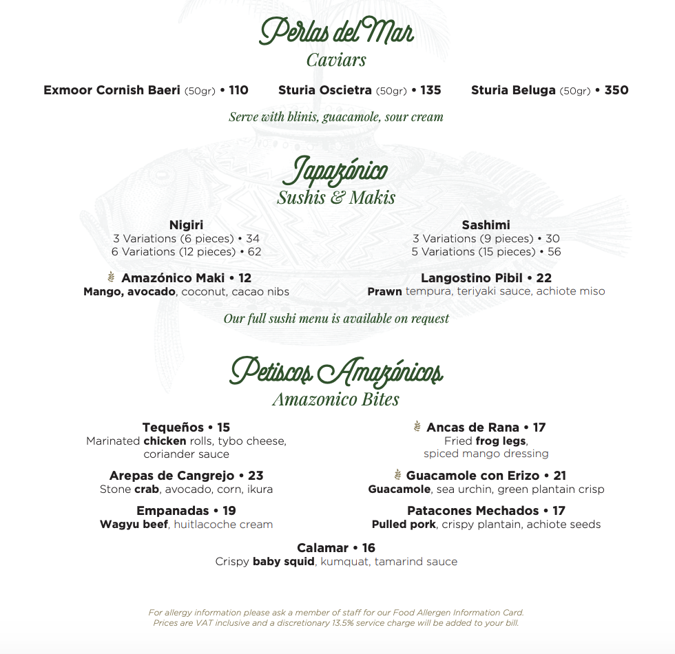

At Amazonico, you can expect to be showered with an array of foods. Its menu covers a whole selection from Latin American descent with bursts of Japanese cuisine. ‘Japazonico’, as they describe it in their menu! It truly is a rainforest of escape…

In regards to their typographic style, the brand does extremely well in aligning themselves with their preferred image. The green/gold/black colour scheme symbolises grandeur and luxury which works even better hand in hand with the script/cursive type. The emerald green colours also serve well in linking to the rainforest-like atmosphere, but also in provoking a sense of mystery. The stroke itself has no contrast, however, the gold outline adds an interesting shadow-like element that makes the text easy to read against all backgrounds. Such restaurants need to make sure that their logos are visible in all scales, a risk when using script type. However, this brand has managed to cleverly use a font other than sans or sans serif and has simultaneously been able to make it so that it is clear despite the scaling.

The menu like many other upscale restaurants uses a combination of typographies in order to transform their essence into the brand. Similar to Victor’s restaurant, Amazonico uses script type for their menu subheadings and a Sans Serif type for the smaller text. At first glance, it may appear that the subheadings and smaller subheadings are in the same typeface, but this is not the case. The smaller subheadings featuring the English translations of each larger heading are actually in a Serif type and appear tamer and easier to read. As the majority of their target audience are English speakers (as a more middle-class restaurant based in London), they have done well in accommodating this through the use of ‘fancy’ Italic type but in making it an easy to read Serif. 

The menu continues to follow the emerald green, black and white colour scheme and even features lighter gold type at the bottom of the page to summarise the company’s stance on service charges. This is a very clever tactic that they have reinforced, in making the writing about service to appear in gold. It intentionally links back to the finer, more graceful, luxurious connotations of the restaurant and presents the idea that the service too is of a similar quality.

Overall, Amazonico have done extremely well in their use of typography for their company as they have not chosen to stick to basics. They have been adventurous and have utilised methods that stand out whilst managing to conform to upscale dining expectations. Well done Amazonico. Hats off to you!